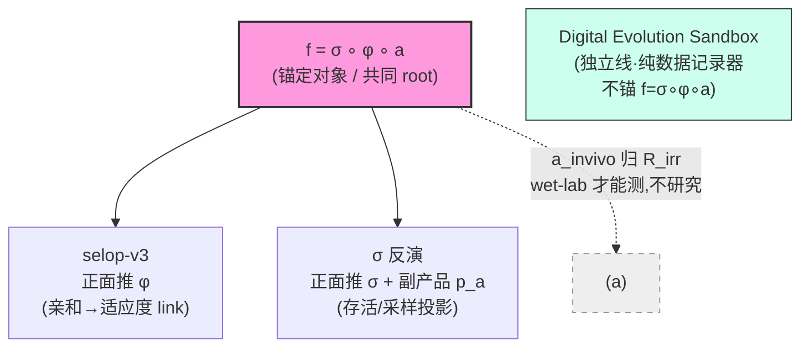

# OUROBOROS-AI4S 工作记录

## 项目树形结构

**两线关系:** selop-v3 与 σ 反演**共享同一 root f = σ ∘ φ ∘ a**,是兄弟分支(非父子),分别啃 φ 和 σ 两个难题;a 拆两半——p_a(功能成分)归 σ 反演副产品,a_invivo(体内真实亲和)公认 R_irr 不研究。两线共享同一元发现(观测=投影复合,逆问题有非平凡零空间),**正交互补不内耗**。DES 是树外独立线。

---

## Digital Evolution Sandbox — 进化沙盒

**这条线是什么:** 红皇后式对称混战进化沙盒,忠实采集全过程时序原始数据(每 tick dump 格子世界 `{strain:count}`)供他人拿去学选择算子;**本身不内建学习器**(带旁路真值的靶场在 selop-v3 线)。f=φ∘a 公式已判否,沙盒不反推 φ,纯数据记录器。**无私货红线照旧守**(否则数据被污染)。

**仓库 / 环境:** `github.com/ouroboros-ai4s/digital-evolution-sandbox`(独立 repo,全推 origin/main)。`D:\anaconda3\envs\basic\python.exe`(torch 2.10+cu128 / RTX 5080 / Windows)。回归锁:430 测试绿(⚠️ 350ms/tick 性能退化待查,见下)。

**已建成(state):**
- **引擎:** 4 阶段 tick(快照→对抗→繁衍含突变→K墙仲裁),四阵营从四象限扩张(血统永不变、同阵营不互斗、跨阵营对抗中和),表型缓存(~15.8ms/tick),record 粒度 Gumbel-max K墙仲裁,异步双缓冲 parquet 记录器。
- **首批数据:** 128²/K64/fill20/T450×4 seeds,4 parquet ~837MB。结局:无 fixation、四阵营共存(末态占比全贴 0.25 → 选择信号≈零,因四阵营全同条)、~1.9 万 distinct 株。
- **viz web app「验收之眼」(Astro 重写,PR#2 merge main `ebfe881`):** aiohttp 单端口托管 `dist/` + WS 每 tick 推帧实时渲染(128² ImageData,阵营=色相/密度=alpha/争夺格混色,最近邻无平滑);复用 Recorder 写隔离 `data/playground/`;前端 Astro static(4 ES 模块 + 5 .astro)。

**核心机制(已锁,reference):**
- **三条 meta 地基:** ① 进化无目标 ② 红皇后频率依赖混战 ③ 表型=序列的固定函数(严禁手写「谁强」)。
- **世界:** 128×128(可扩 512²)2D 格子,每格 `{strain:count}`,K=64 上限。
- **统一基元:** 所有基元 = `formula(x,i)→输出束` 一阶函数。五类 F繁衍/P突变/Z对抗,backbone(锁死)vs 插槽(可突变)唯一别=locked/mutable。上位=κ 同通道族自协同 `量·(1+κ)^{n_same}`(κ=0)。**结局常数(μ/z_max/δ/p_max/α/κ/β)锁死 registry,永不进 CLI/config。**
- **BB0 模板:** 16位/6插槽/10 locked。默认局四阵营全同条仅 faction 不同;viz 起放开为「同模板结构」——锁死位/骨架/插槽位置/调色板全同,仅 6 插槽取值可不同(过 `validate_bb0_layout` 守门),默认路径回退全同条字节级不变。**放开起始基因型 ≠ 破无私货:四阵营仍同模板、同固定 G→P,无手写「谁强」系数。**
- **数据 schema:** 每局一 parquet,long format 每行 `(tick,cell_x,cell_y,strain,count,faction)`,strain 存完整序列串,每 tick 全量快照。
- **reframe(已锁结论):** f 不是标量 f(序列)→适应度,而是上下文函数 f(株,局部上下文)→该株此 tick 增减(证据:同序列 count 5675→1 都有)。

**启动(两步 + 模块形式必须):** ① 建前端 `cd webapp/frontend; npm install; npm run build`;② 根目录 `$env:PYTHONPATH='src'; D:/anaconda3/envs/basic/python.exe -m webapp.server` → localhost:8000。`-m` 必须(server.py 绝对导入,脚本跑会 ModuleNotFoundError)。**踩坑:** live 点格子读内存 world(`frame.cell_detail`)非 parquet(footer 只在 close() 写,跑中读 500);单线程 event loop + step() 同步无半步竞态。

**设计文件:** `context/digital-evolution-sandbox/2026-06-11-16-10-design.md`(全貌)、同目录 `2026-06-20-numerical-round-protocol.md`、`2026-06-20-22-00-descaffold-unified-primitive.md`。

**当前活跃:全 68 基元落地 — 9-spec 路线图:**
- **目标:** registry 6→68 全基元,并统一 `src/`(pytorch 后端)+ `webapp/`(astro 前端)为一系统、保两种运行(① 全 bash CLI 给 AI 批量产数据 ② web 界面给人手动看)。**纪律:游戏设计已终,凡需「新增概念」必是实现者理解错——只补 registry 数据行 + 复用既有机制,不发明玩法。**
- **9 spec(全写完+评审+推 origin/main `f6d772f`,`docs/superpowers/specs/2026-06-24-s{0..8}-*.md`),实现序 S0→S6→S1→S2→S4→S5→S3→S7→S8:**
  - **S0** 统一入口+CLI match-runner(两种运行地基);key allow-list 只放 {players,grid,K,fill,T,seed},挡结局常数进 config。
  - **S6** motif 粒度(横切地基):GRAN/MOTIF_LEN 表、_spectrum_for 同粒度+等长预过滤、_mutation_outcomes 整块覆写、predicate-bit 方案+全词表、n_locked 按需算不存。
  - **S1** vis 通道:per-primitive vis、填 S6 预留 FEAT_N_LOWVIS 位、逆 vis 命中。
  - **S2** 塑形突变谱:_spectrum_for 读 SPECTRUM_SHAPE(power/family_mask/flatten_mix 三旋钮)+ 10 新 P 行。
  - **S4** 动态方向:F 池方向集 + crc32 序列哈希锁向(F4Nr1 锁 1/4)。
  - **S5** 相位窗 f:FBURST/F_NOVA,`on=((T-birth)%burst_w)<burst_k; f=where(on,f_hi,f_lo)`,静态默认字节级不变,`f` 留作 f_hi 别名。
  - **S3** 富猎物谓词:填 S6 预留 4 阈值位(Crest/Hotspot Snipe/Mirror Fang/Void Bite),不动 kernel。
  - **S7** 多位突变:slots_per_event,N==1 不变、N≥2 联合枚举(P_cascade 2 位)。
  - **S8** A 池 24 极端 de-gate(纯 affinity 谱可达,n_locked 门作废)+ 多 P 谱混合 `Σpᵢqᵢ/Σpᵢ` 取代 dominant_p。
- **评审两裁定(bake 进 spec + memory `project_des_spec_review_rulings.md`):** ① 谱重录基线(全 68 affinity 谱才是设计,6 字母是残缺截断,长全后 RE-RECORD fixtures,字节锁此后护非 registry 代码路径);② 多 P 混合归 S8。

**待办闸口:** ① ~~9 个 plan 文件编写~~ **已完工(2026-06-25)。** ② ~~SDD 实现 S0→S8~~ **已完工(2026-06-26)。** ③ **非对称角色系统(per-faction K/突变率/机制)仍独立 HARD-GATE**——与 68-基元落地无关、未碰,需用户拍才进 brainstorming。④ **RE-RECORD affinity-spectrum fixtures**——tooling 缺失(des.tools.record_fixtures/des.smoke/tests/fixtures/ 均不存在,0 skip 可升级),两路可选:A(inline snapshot test,简单)/ B(按 plan letter 先建工具)——决策待用户拍板。⑤ ⚠️ **性能退化**——350ms/tick vs 基线 ~28ms,原因疑为 A 池涌现驱动表型缓存 churn(ALPHABET 6→68 后 _spectrum_for inner loop 扩大),待查。

**实现进度(SDD,roadmap `2026-06-25-9-spec-execution-roadmap.md`):** **S0 ✓(2026-06-25,commits a631656..7704b5b)** — run.py 共享核心 + run_match.py CLI 前门;tests 146→165。**S6 ✓(2026-06-25,commits 4627b48..0daf694)** — GRAN/MOTIF_LEN 表 + motif_blocks + _spectrum_for gran-match + _mutation_outcomes 4-arg 块覆写 + n_locked + PREDICATE_BITS 15名 + feature_mask_of/prey_mask_for_clauses + phenotype() 谓词位改写 + validate_bb0_layout;tests 165→198。**S1 ✓(2026-06-25,commits 0daf694..83f2c2c)** — VIS 表 + vis_sum/n_count + vis_mode + phenotype-array 列 + phase1_antagonism vis-mode 分支 + vis_lowvis 谓词位;tests 198→224。**S2 ✓(2026-06-25,commits 83f2c2c..2d339be,push origin/main)** — ALPHABET/GRAN/_P 扩 6→16/2→12;SPECTRUM_SHAPE 12行;_spectrum_for 读三旋钮;tests 224→244。**S4 ✓(2026-06-25,commits 2d339be..ac55954)** — F池方向集+crc32锁向;tests 244→282。**S5 ✓(2026-06-25,commits ac55954..543b961)** — FBURST/F_NOVA 相位窗 + f_hi/f_lo/burst_w/burst_k;tests 282→317。**S3 ✓(2026-06-26,commits 543b961..80a262d,push origin/main)** — _Z_PREY_CARD + feature_mask_of 三阈值 + prey_mask_for_clauses 4新clause-tag;tests 317→345。**S7 ✓(2026-06-26,commits 80a262d..554afc7,push origin/main)** — SLOTS_PER_EVENT + N≥2 joint enumeration;tests 345→368。**S8 ✓(2026-06-26,commits 554afc7..e3178b8,push origin/main)** — A池 24行 de-gate(n_locked门作废,纯affinity谱可达) + 多P谱混合 Σpᵢqᵢ/Σpᵢ;tests 368→415。**gap-fill ✓(2026-06-26,commits e3178b8..cbf5458,push origin/main)** — ALPHABET 46→68:N1-N7(含N4/N7 motif-gran)+ Z-core 15字母注册;test_motif.py 跨族断言放宽;tests 415→430。**RE-RECORD 待定**——affinity-spectrum fixture 工具尚未建,两路可选 A/B,等用户裁决。⚠️ **350ms/tick**,基线 ~28ms,数据采集前需修复。

---

## 选择算子 v3 — f=σ∘φ∘a 的 φ 支线(生发中心,带旁路真值)

**树形定位:** 共同 root **f = σ ∘ φ ∘ a** 下两条兄弟支线之一(另一条=σ 反演)。本支线正面推 **φ**(亲和→适应度 link,同 Matsen/Victora 阵营),把 σ 当「承认存在的 irreducible 障碍」不正面碰;a 不研究(a_invivo 归 R_irr,wet-lab 才能测)。走树-SBI 路线。**与 σ 反演线共享元发现(观测=投影复合,逆问题有非平凡零空间),正交互补**。**起源已弃不看**:v1 的 f=φ∘a 在侦察阶段被三裂缝推翻(a 错观测量 / 缺 σ 存活算子 / φ 因果不可辨,Weinstein 2022);v1/v2 全部 context(`context/selection-operator-v1|v2/`)是回溯档案,**v3 不依赖,无需再读**。

**v3 诚实骨架(对抗轮降级后,所有后续工作的地基):** 不是 18 补丁、也不是「1 原理解释一切」,而是 **1 EARNED 动力学原理(锚两条框架无关硬禁止:Price 协方差 / 噪声-N_e 标度)+ 2 正交独立支柱(σ / 辨识)+ 1 诚实残余 R_irr(Φ 算子零谱 = Noether 对称轨道,wet-lab 才能测的 a_invivo)+ 1 显式适用包络**。挣来的简约,非装饰简约。骨架只生成通道1动力学,σ 与辨识是独立支柱(「单一骨架统一三层」是 elegance-trap,已降级)。

**方向决议(North Star round-3):** 在诚实骨架上选 **A+D** —— 先在沙盒里跑出 P1/P2 等「设计了但未实测」的预测(A),终点收在 wet-lab 最小介入(D 推迟到沙盒做完)。**这是工程实现轮 → 走 `brainstorming` → `writing-plans`;HARD-GATE:设计未批准前不进任何实现。**

**拆三子项目(依赖序,逐个做):** 引擎(1/3)→ 恢复模型(2/3)→ 基线(3/3)。三目录 + context-init 已建:`context/selop-v3-engine|recovery|baseline/`。引擎产出契约 = 后两者的输入接口。**注意:此 selop-v3 沙盒 ≠ digital-evolution-sandbox(那是另一条线,纯数据记录器,不带真值算子)。**

**引擎「是什么」已收口(6 决议锁定):** 底线 = 不许怎么简单怎么来、不许交付好验证但没用的 MVP、须建在真实开源数据上(适度合成,非随意过简模拟)。引擎 = **A 层(world-model 式逼真生发中心环境,多开源数据搭「非常厚」,无私货,过保真度闸门)+ B 层(三个有物理依据、被旁路记录、可证伪的真值算子,当驱动演化的因果之手)**。三算子物理落地:a_invivo 走 catch-bond(Bell-Evans)/ σ 走 T-help 瓶颈竞争(Victora-Nussenzweig)/ φ 走频率依赖克隆竞争+克隆干涉(Gerrish-Lenski)——选生发中心是因为只有它让三算子物理上彼此独立。**A/B 严格责任隔离 = 防自欺命根子;算子是因果驱动律(导演)非事后标签;带旁路真值的合成引擎是逻辑必需(非偷懒)的验证路径。**

- **6 决议:** ① 分辨率=甲(生发中心忠实 agent-based);② 引擎=A 层逼真环境 + B 层三物理真值算子;③ 算子=因果驱动律非事后标签;④ A 层用开源数据经「多视图对角整合 / 共享隐空间还原」搭厚;⑤ 拼接欠定 → 只支撑 A 层逼真度 + 保真度闸门,绝不碰 B 层真值;⑥ 拼接非唯一性转化为 P1 鲁棒性 stress test(一族合理拼接下 P1 都成立=真信号,只一个成立=假象)。
- **架构约束:** 只用 Transformer/Mamba/Diffusion,图作 attention bias,不用独立 GNN/CNN/RNN。**陷阱**:A 层 Diffusion 的 score=∇log μ_t=FV drift 与 B 层测度流骨架同源 → A 层 Diffusion 只许生成可观测统计量,绝不当 B 层真值源。

**对抗轮交棒的 7 条约束(任何实现必带):** ① 三非循环铁律(引擎个体级·绝不实现测度流 PDE 当真值源 / σ-φ噪声-a_invivo 走涌现+记录非手写 / do() 真个体级介入非改方程参数);② 5 个对抗性真值世界(σ部分可吸收/外加噪声/非ΔG-catch-bond/三通道强共线/真存在静态φ——让理论诚实失败);③ 首验命名预测 P1(克隆干涉 Nμ≫1 区富集比-φ 非单调)+P2;④ 命题①须先定阈值(三子空间主夹角θ + dim R_irr/dim全谱 ε)否则不可证伪;⑤ 判别第四路(自底向上从 CR9114/CR6261 DMS、对测度流盲、纯统计视角);⑥ 适用包络内外分测;⑦ B5 奥卡姆诊断(最小介入优化子模性 vs 三子空间直和度)。

**最硬骨头(尚未开工):** 问题 A = 原创共享隐空间还原机制(不套 MOFA/GLUE,用 ESM/AntiBERTy/IgLM/突变效应/结构嵌入把各数据集嵌同一隐空间,以预训练先验约束欠定解;须接住四风险:隐空间不天然对齐 / 预训练偏置渗进 A 层 / 缺口维度怎么生成 / 表征会否泄漏 φ);问题 C = tick 事件顺序(属真值定义,倾向异步事件驱动)。

**context:** `context/selop-v3-engine/2026-06-13-16-58-engine-init.md`(引擎主文件,6 决议 + 32 条技术 checkpoint);父设计 `context/selection-operator-v3/2026-06-13-16-49-sandbox-design.md`(活文档);方向 `…-16-27-northstar-round3.md`;`context/selection-operator-v3/INDEX.md`(登记三子项目)。spec:v3 = `docs/de-anthropocentric/specs/2026-06-12-selop-frontal-breakthrough-v3-spec.md`。

**HARD-GATE:** 卡在引擎「共享隐空间还原机制」设计(问题 A),设计未批不进实现。

---

## σ 反演 — f=σ∘φ∘a 的 σ 支线(survivorship-PU,与 φ 线正交)

**树形定位:** 共同 root **f = σ ∘ φ ∘ a** 下两条兄弟支线之一(另一条=selop-v3 推 φ)。本支线正面反演 **σ**(存活/采样投影)本身,把观测算子四分量合回单一似然;**p_a 是副产品**(σ 四分量之一 D=反卷积闭环)而非另起目标;a_invivo 不研究(归 R_irr)。selop-v3 把 σ 当「黑箱障碍」推 φ,本线把 σ 当「主对象」拆开——**两线共享元发现(观测=投影复合,逆问题有非平凡零空间),正交互补不内耗**。走 survivorship-PU,站外部铁证 Evo-PU(arXiv:2605.06879)肩上补它的抗体洞。**核心纪律(继承 selop):反演整个观测算子 + 诚实标零空间,不是造更好的功能预测器。** **状态:7-stage 设计全完成,卡在「确认起 `executing-specs` 落代码」闸口(详见末尾下一步)。**

**数学骨架(Evo-PU,原文核对一致):** `P(O=1|x)=p_a·[1−∏_{y∈Y(x)}(1−p_o·p_e)]`。σ 四分量 = A 突变可达 p_e / B 监测 p_o(x,m) / C 选择复合 σ₁∘σ₂ / D 反卷积闭环;四面必须合回单一似然才叫「彻底」。

**执行模式(用户拍):** 岔口1=B(可达性验证 + 报告数字 + 小 smoke,非全管线/非 OAS 全量下载)/ 岔口2=A(每 stage 闸口暂停汇报后再推进)/ 中文简洁汇报。

**7 stage 全 `[x]` 执行完成(spec `docs/de-anthropocentric/specs/2026-06-13-sigma-operator-inversion-spec.md`,每 stage Completion Criteria 硬闸 PASS,无强制 Backtrack):**

- **Stage 1 knowledge:** 五块知识到可建模级 + baseline;64 search/20 full-text;三冒烟过(S5F=published HH_S5F / SHM kernel 破 flat-Hamming 1.60 log / OLGA Pgen 端到端,无需 IGoR 编译)。★新认知:类先验 `[1−∏(1−p_o·p_e)]` 数学等同 birth-death **非灭绝条件因子** → 用 ascertainment 同余类统一刻画可辨识性。
- **Stage 2 可辨识性闸(最前置):** governing variable 锁死 = 线性化观测映射 Φ 的秩/谱(非预测精度)。**σ 可辨识地图:** p_a 可辨到单调变换 / σ₂ 仅 contrast 可辨(拐点辨斜率耦合) / σ₁ 可辨到尺度(out-of-frame 锚) / p_o 跨study contrast可辨\*+single-study irreducible。**中心结果:(p_e,选择,p_o) 不联合可辨**(Bakis-Minin λ/μ/ρ 映射)。**★真 CR9114(65094 行)实测 θ(S_mut,S_sel)=0.0°** = 裸突变计数与选择完全混淆的硬实例 → **p_e 必须用 5-mer 上下文非线性 kernel**(从工程选择升级为辨识性必需)。零空间两源:single-study 格子 + fitness-scale(1维)。6 承重假设 negate。
- **Stage 3 hypothesis:** 8 可证伪命题(每条带定量 BROKEN 阈值),攻击序 A→C→B→D 依赖驱动。防 paper 化护栏 verbatim 置顶,0 条以可发表性为存在理由。
- **Stage 4 造算子:** 四模块(M_e S5F 5-mer / M_o 分层GLM / M_sel OLGA+SONIA+sigmoid / M_a 代数反解)合回单一似然(占不同因子位非拼接)。**★桥1完整数学等价:Evo-PU 类先验 = birth-death 非灭绝 ascertainment 因子(把 H-B2 从类比升为代数等价)。** 桥2:out-of-frame=Heckman exclusion restriction;桥3:single-study=IPW positivity violation。
- **Stage 5 convergence:** verdict=ACCEPT WITH REVISE。feasibility 真测(OLGA✓/CR9114✓/核心栈✓ 可即跑;SONIA/netam-Thrifty 未装但 Stage7 才硬需)。多准则 21/25(禁可发表性轴)。4 REVISE:R1 破循环主力=σ_gen/σ_inf 分量层独立(非双kernel)/R2 加性=toy简化/R3 p_o带星号/R4 σ₁σ₂ model-based。

**(承重结论 + Ledger + Stage 6/7 续下条)**

- **Stage 6 自建证伪套(7 skill,`context/selection-operator-v2/stress-test-skills/`,非引擎默认):** 赢条件翻转为主动证伪,产 **FalsificationLedger 三桶**(无 resilience 分/无 hardening)。circular-validation-audit 先跑(gate Stage7)=**CONDITIONAL GREEN-LIGHT**,4 对抗真值硬性入设计(non-sigmoid选择/真OAS监测+未知single-study格子/非SHM可达/σ部分可吸收);确认 R1(双 kernel 同 SHM family 仅 PARTIAL 去循环,真破循环靠 σ_gen/σ_inf 分量层独立)。
- **Stage 7 闭环验证设计(只设计不实跑):** 六环(真值实测CR9114→σ_gen采样唯一合成参数A→σ_inf反演参数B≠A→重建→比对分可辨/irreducible/对抗三方向→残差只refine可辨方向);2 真实交叉验证轴(DeWitt GC-replay=σ₂真值锚 / OAS=p_o协变量+最危险C5判决场);判别第四路(纯统计对π·S形盲,判N_eff≈1.3);4 零空间实证指标(可恢复率/dim R_irr/θ敏感带/对抗诚实失败率);6 caveat。五项硬闸全 PASS,不含纯合成沙盒。

**★FalsificationLedger 裁定(11 主张全三桶,诚实):**
- **CORROBORATED(6):** C8 (p_e,选择,p_o)不联合可辨(**真CR9114 θ=0 硬证 + 双路径抗 H-B2 BROKEN**)/ C7 联合似然合一 / C6 桥1(rung2 子结构同构)/ C2 σ₂拐点(pending)/ C9 零空间可计算(weak)/ C10 闭环非循环(conditional)。
- **BROKEN(1,条件性已降级不致命):** C3 out-of-frame selection-free → 受 mRNA/表达弱选择 → σ₁ 锚降级「弱选择baseline+偏差项」,辨识增益①减弱不消失,不回退。
- **TESTABLE-NOT-YET(3,押 Stage7):** C1 p_e解耦(真S5F全表,toy仅6.59°<15°)/ C4 p_o跨study / **★C5 H-A3元数据非混杂(最危险,BROKEN则ε越界回Stage2需用户确认)**。
- **PROMISING-UNEARNED(1):** C11 四分量 elegance → 待验预测 P1(真表θ>15°+AUC超flat)兑现才 EARNED,坦白未完全 earn。
- **同构修正:** C6 从「本课题 σ=Evo-PU σ」降为 rung2(类先验=非灭绝因子为真,但 p_o(x,m)+germline lineage 严格超出 Evo-PU,整体不同构)——反而部分反驳「σ反演=Evo-PU换数据集」嫌疑。**N_eff≈1.3**(三桥 framing 诱导,σ=π·S 降为强假设待第四路)。

**最大未决风险敞口:** C5(元数据非混杂)= p_o 可辨性命门,完全押 Stage7 OAS 实测(控study后cell偏R²<0.05即BROKEN)。

**关键开源数据(全本地或可达):** CR9114/CR6261 完备 K_D parquet(答案钥匙,已有)/ DeWitt GC-replay(Zenodo 15022130,σ₂真值)/ OAS(ConvergeBio/oas-unpaired,p_o协变量)/ S5F 本地(已验=HH_S5F)/ OLGA(σ₁,已装可跑)。关键 paper:Evo-PU arXiv:2605.06879、Bakis-Minin 2508.09519、Louca-Pennell Nature2020、abundance≠affinity PMC5337809。

**所有 context 在哪 / 怎么续 background:** 7 个 `context/sigma-inversion-*.md`(ka-knowledge/identifiability/hypotheses/operator-design/convergence/falsification/experiment-design),先读跨-stage 汇总 `context/sigma-inversion-INDEX.md`(可辨识地图 + FalsificationLedger + 最终 Research Design 全填好)。memory 见 `project_sigma_operator_direction.md`。

**下一步(交还用户):** 本 spec 到设计为止(Stage7 只设计不实跑)。要真跑闭环 = 另起 `executing-specs` 落成代码——最小可行核(M_a+S5F+OLGA+GLM+CR9114)现在就能跑,三缺口(SONIA/Thrifty/OAS全量)Stage7 才硬需。**未经用户确认不进实现。**
