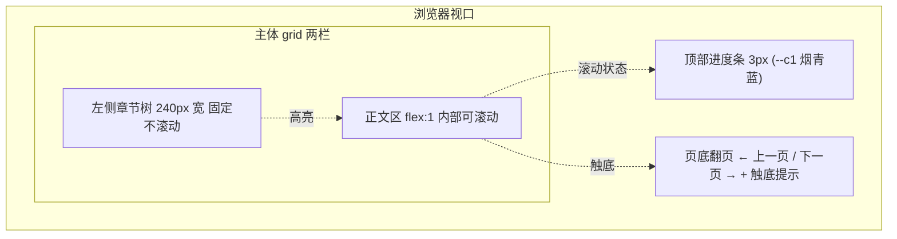
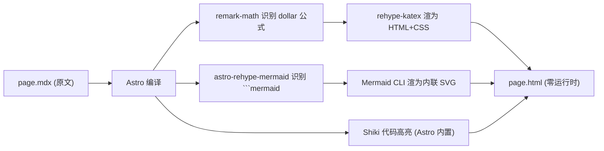

# 三线推进 Presentation — 设计 Spec

**日期:** 2026-06-25
**目标输出:** `presentation/three-track-progress/` 一个 Astro 5.x 静态站,12 页技术 wiki blog 长文,介绍 OUROBOROS-AI4S 三条研究线(DES / selop-v3 / σ 反演)。
**用途:** 和人讨论用,跨领域技术人受众。
**状态:** 设计阶段,未批准不进 writing-plans。

---

## 1. 项目结构

**目录:** `G:\OUROBOROS-AI4S\presentation\three-track-progress\`(与 `digital-evolution-sandbox/` 平级,作为 OUROBOROS-AI4S 根下的元资料)。

```
presentation\three-track-progress\
├─ astro.config.mjs                      MDX + Mermaid + KaTeX 插件
├─ package.json                          Astro 5.x + 几个 remark/rehype 插件
├─ src\
│  ├─ content\
│  │  ├─ config.ts                       Collections schema(order/title/chapter)
│  │  └─ pages\
│  │     ├─ 01-overview.mdx              P1 项目全景
│  │     ├─ 02-des-intro.mdx             P2 DES 是什么
│  │     ├─ 03-des-mechanism.mdx         P3 DES 核心机制
│  │     ├─ 04-des-roadmap.mdx           P4 9-spec 路线图
│  │     ├─ 05-f-formula.mdx             P5 f = σ ∘ φ ∘ a 详解
│  │     ├─ 06-selop-skeleton.mdx        P6 selop-v3 诚实骨架
│  │     ├─ 07-selop-engine.mdx          P7 引擎 6 决议 + 7 约束
│  │     ├─ 08-selop-bone.mdx            P8 最硬骨头 + HARD-GATE
│  │     ├─ 09-sigma-math.mdx            P9 σ 数学骨架
│  │     ├─ 10-sigma-stage1-4.mdx        P10 Stage 1-4
│  │     ├─ 11-sigma-stage5-7.mdx        P11 Stage 5-7
│  │     └─ 12-sigma-ledger.mdx          P12 Ledger + C5 + 数据 + 下一步
│  ├─ layouts\
│  │  └─ Chapter.astro                   主布局:侧栏 + 正文 + 进度条 + 翻页脚
│  ├─ components\
│  │  ├─ Sidebar.astro                   左侧章节树
│  │  ├─ PageNav.astro                   页底「← 上一页 / 下一页 →」
│  │  └─ ProgressBar.astro               顶部 3px 进度条
│  ├─ pages\
│  │  ├─ index.astro                     重定向到 /01-overview
│  │  └─ [slug].astro                    动态路由,消费 content collection
│  ├─ scripts\
│  │  └─ nav.ts                          左右键 + 触底再滚翻页 + 触屏滑动
│  └─ styles\
│     └─ global.css                      重置 + Monet 5 色变量 + base typography
└─ public\
   └─ favicon.svg
```

**关键决策:**

- `presentation/` 放 OUROBOROS-AI4S 根下,不放进任何子项目——这份是「介绍三线」的元资料,跟任何具体子项目不该有依赖。
- 单一动态路由 `[slug].astro`:12 页共享 `Chapter.astro` 布局,只换内容。
- 不引入 Tailwind,自定义 CSS 200 行内搞定;`global.css` 一份,不拆 `prose.css`。
- 不做 `<Term>` / `<Concept>` 语义组件,术语和自创概念在 MDX 行文里用括号或破折号就近补注。

---

## 2. 全局布局与导航

### 2.1 布局结构



### 2.2 桌面布局(≥ 1024px)

- 左侧章节树:`240px` 宽,固定不随正文滚动,4 章 12 页树状,当前页用 `--c5 粉紫` 圆点 + 加粗;当前章节自动展开,其他章节收起可点击展开。
- 正文区:`flex: 1`,内部可滚动,最大宽度 `800px` 居中(防止超宽屏一行字过长)。
- 顶部进度条:`3px` 高,色 `--c1`,反映**当前页内滚动比例**(不是全 12 页进度,那由侧栏体现)。
- 页底翻页脚:常驻 `← 上一页标题` / `下一页标题 →`;触底之前灰显;触底瞬间 `下一页 →` 变 `--c5` 加粗 + 显示「继续下滚进入 ↓」提示。

### 2.3 移动布局(< 1024px)

- 侧栏折成顶部汉堡菜单,正文全宽,内边距收窄。
- `Esc` 关菜单。

### 2.4 翻页交互

| 输入 | 行为 |
|---|---|
| `←` / `→` | 翻页(总是可用,不需触底) |
| `Home` / `End` | 跳第一页 / 最后一页 |
| 滚轮 / `↓` | 正常滚动正文 |
| **触底后再触发一次滚轮** | 跳下一页(走 Astro ViewTransitions) |
| 触屏左滑 / 右滑 | 翻页 |

触底再滚的判定:`scrollTop + clientHeight >= scrollHeight - 4`(4px 容差)。判定后**至少 100ms 静默期**才接受下一次 `wheel` 事件,防 Mac trackpad / 触屏的惯性滚动连翻。

---

## 3. 内容编写规则

**风格:** 技术 wiki blog 长文,密度高,通俗化,跨领域技术人受众。

**术语处理:** 行业通用专业术语首次出现时用括号或破折号就近补注一句即可,如 `SHM(体细胞超突变,B 细胞在生发中心反复随机点突变)`。后续不再注释。**不设组件、不设字典文件、不做 hover 浮层**。

**自创概念处理:** 项目内部自创的概念(R_irr / FalsificationLedger / 诚实骨架 / 红皇后混战 / Φ 算子零空间 / 北极星 A+D / 三非循环铁律 等)首次使用时,用一段 MDX 引用块或单独段落把概念解释清楚,**未解释不许直接使用**。后续再引用时只写名字。

**配色 lock:** Monet 睡莲 5 色,贯穿全站,不引入第六色。

```css
:root {
  --c1: #6B8E9B;  /* 烟青蓝 — accent 主色 */
  --c2: #89A894;  /* 灰绿 — accent2 / link hover */
  --c3: #A6C0B5;  /* 浅薄荷 — soft / border */
  --c4: #C3B1BD;  /* 灰紫 — code bg / muted */
  --c5: #D8A4CA;  /* 粉紫 — 强调 / highlight / 当前页标记 */
}
```

**主题:** academic-dark 单主题。背景近黑(`#0a0a0f`)+ 上述 5 色 accent。**不做暗 / 亮主题切换。**

**图示:**
- 流程图、状态图、时序图、树图 → Mermaid `flowchart` / `stateDiagram` / `sequenceDiagram`
- 架构图、模块组成图、分层图(方方正正大方块) → Mermaid `block-beta`
- 极少数 Mermaid 表达不出来的(如四漏斗箭头、生发中心分层、风险对照表) → 手写 SVG 嵌入,沿用 Monet 5 色变量

**公式:** KaTeX 全渲染,行内 `$...$`,块级 `$$...$$`,构建期渲完零运行时。

**代码块:** 默认不写代码;若必须出现(启动命令、registry 行示例),用 Astro 内置 Shiki 高亮,主题 `github-dark-default`。

**字体链:**
- 中文:`'PingFang SC', 'Microsoft YaHei', 'Noto Sans SC', sans-serif`
- 等宽:`'Fira Code', 'Cascadia Code', Consolas, monospace`

---

## 4. 每页内容设计(P1-P12)

每页四段写:**核心论点 / 关键事实 / 必带图 / 字数**。**细节写作时从 `G:\OUROBOROS-AI4S\context\` 和 `G:\OUROBOROS-AI4S\digital-evolution-sandbox\context\` 取真实内容**,不要凭 CLAUDE.md 摘要硬写。

默认密度 A 紧凑(800-1500 字/页),标 ★ 的页提到 1500。

---

### Ch.1 项目全景

#### P1. 三线树形结构 + 阅读指南

- **核心论点:** OUROBOROS-AI4S 不是一个项目,是三条并行推进的研究线;两条共享同一公式 root,一条独立。
- **关键事实:** root = f = σ ∘ φ ∘ a;selop-v3 推 φ;σ 反演推 σ + 副产 p_a;a_invivo 归 R_irr 不研究;DES 树外,纯数据记录器,不锚 f 公式;两支线共享元发现(观测=投影复合,逆问题有非平凡零空间),正交互补不内耗。
- **必带图:** Mermaid 树形图(CLAUDE.md 顶部那张)+ `block-beta` 三线职责对照矩阵。
- **字数:** ~1200。

---

### Ch.2 Digital Evolution Sandbox(树外独立线)

#### P2. DES 是什么 + 已建成

- **核心论点:** 红皇后式对称混战进化沙盒,**只忠实采数据,不内建学习器**;f=φ∘a 已判否,沙盒不反推 φ,选择算子靶场在 selop-v3 线。
- **关键事实:** 独立 repo `github.com/ouroboros-ai4s/digital-evolution-sandbox`;128² grid / K=64 / 四阵营从四象限扩张(血统永不变、同阵营不互斗、跨阵营对抗中和);4 阶段 tick(快照→对抗→繁衍含突变→K墙仲裁);表型缓存 ~15.8ms/tick;parquet 长格式 `(tick, cell_x, cell_y, strain, count, faction)` 每 tick 全量快照;首批 4 parquet ~837MB,末态四阵营各贴 0.25 → 选择信号≈零(同条);Astro web app「验收之眼」WS 实时推帧 PR#2 已合并 main `ebfe881`;回归锁 285 引擎 + 146 web 测试绿。
- **必带图:** `flowchart` 4 阶段 tick 流程;`block-beta` 系统架构(引擎 / 记录器 / web 验收 三层)。
- **字数:** ~1400。

#### P3. 核心机制(地基 / 基元 / 模板 / schema)★

- **核心论点:** 三条 meta 地基锁死游戏设计:进化无目标 / 红皇后频率依赖 / 表型=序列的固定函数(严禁手写「谁强」)。
- **关键事实:** 统一基元 = `formula(x,i)→输出束` 一阶函数,五类 F繁衍/P突变/Z对抗;backbone(locked)vs 插槽(mutable)唯一别;上位 = κ 同通道族自协同 `量·(1+κ)^{n_same}`(κ=0);**结局常数(μ/z_max/δ/p_max/α/κ/β)锁死 registry 永不进 CLI/config**;BB0 = 16 位/6 插槽/10 locked,默认局四阵营全同条仅 faction 不同;viz 起放开为「同模板结构」,锁死位/骨架/插槽位置/调色板全同仅 6 插槽取值可不同(过 `validate_bb0_layout` 守门),默认路径回退全同条字节级不变;**reframe 已锁:f 不是标量 f(序列)→适应度,而是上下文函数 f(株, 局部上下文)→该株此 tick 增减**(证据:同序列 count 5675→1 都有)。
- **必带图:** `block-beta` 单一基元结构图(formula / 输入 / 输出束 / locked-mutable 区分);`flowchart` BB0 模板 16 位 layout 示意。
- **字数:** ~1500。

#### P4. 全 68 基元 9-spec 路线图

- **核心论点:** registry 从 6 扩到 68;9 个 spec 锁死实现顺序;游戏设计已终,凡需「新增概念」必是实现者理解错——只补 registry 数据行 + 复用既有机制,不发明玩法。
- **关键事实:** 实现序 S0→S6→S1→S2→S4→S5→S3→S7→S8:S0 统一入口+CLI(key allow-list 只放 {players,grid,K,fill,T,seed})/ S6 motif 粒度横切地基(GRAN/MOTIF_LEN 表)/ S1 vis 通道 / S2 塑形突变谱(power/family_mask/flatten_mix 三旋钮 + 10 新 P 行)/ S4 动态方向(F 池方向集 + crc32 序列哈希锁向)/ S5 相位窗 f(FBURST/F_NOVA,静态默认字节级不变)/ S3 富猎物谓词(填 S6 预留 4 阈值位)/ S7 多位突变(slots_per_event,N≥2 联合枚举)/ S8 A 池 24 极端 de-gate(纯 affinity 谱可达,n_locked 门作废)+ 多 P 谱混合 `Σpᵢqᵢ/Σpᵢ` 取代 dominant_p;评审两裁定:谱重录基线(全 68 affinity 谱才是设计,6 字母残缺截断,长全后 RE-RECORD fixtures)/ 多 P 混合归 S8;9 个 plan 全落盘 11705 行;**实现进度:S0 ✓(2026-06-25,commits a631656..7704b5b,165 passed),下一闸 S6**;下一闸:plan 全好才进 SDD/executing 实现;非对称角色系统(per-faction K/突变率/机制)独立 HARD-GATE 未碰。
- **必带图:** `flowchart` 9 个 spec 的依赖序与横切关系(S6 标横切 / S8 标合流终点 / S0 ✓ 标已完成);`block-beta` 9-spec 在系统中的位置(S0 入口层 / S6 粒度层 / S1-S5 表达力层 / S7-S8 终态)。
- **字数:** ~1400。

---

### Ch.3 选择算子总框架

#### P5. f = σ ∘ φ ∘ a 详解 ★

- **核心论点:** 这不是个一开始就有的公式,是 v1(f=φ∘a)被三裂缝推翻、v3 重建出来的公式;它定义了为什么 selop-v3 和 σ 反演必须是两条兄弟线。
- **关键事实:** 三模块 —— a(亲和,K_D 物理量)/ φ(适应度 link,生发中心内非单调,T-help 瓶颈+频率依赖+克隆干涉)/ σ(存活与采样的复合投影);复合方向**右→左**(序列 → a → φ → σ → 你看到的数据);v1 三裂缝(Weinstein 2022):① a 错观测量(in-vitro K_D ≠ in-vivo a_invivo)② 缺 σ 存活算子(abundance ≠ affinity,PMC5337809)③ φ 因果不可辨;a 拆 p_a(σ 反演的 D 闭环副产)和 a_invivo(R_irr,wet-lab 才能测,公认不研究);σ 进一步拆四分量(p_e 突变可达 / p_o 监测 / σ₁∘σ₂ 选择复合 / D 反卷积闭环),源自 Evo-PU 公式 `P(O=1|x)=p_a·[1−∏(1−p_o·p_e)]`(arXiv:2605.06879)。
- **必带图:** `flowchart` v1 → v3 三裂缝推翻演化;`block-beta` 三模块输入输出契约(序列 → a → φ → σ → parquet);手写 SVG 四漏斗箭头图(B 细胞 → 三生物漏斗(p_e / σ₁σ₂ / p_o)→ 进 parquet,D 是反向反卷积)。
- **字数:** ~1500。

---

### Ch.4 selop-v3(φ 支线)

#### P6. 诚实骨架 + 北极星 + 三子项目

- **核心论点:** v3 不是 18 补丁,也不是「1 原理统一」,而是 **1 挣来的动力学原理 + 2 正交支柱 + 1 残余 R_irr + 1 适用包络**;挣来的简约,非装饰简约。
- **关键事实:** 1 EARNED 动力学原理锚两条框架无关硬禁止(Price 协方差 / 噪声-N_e 标度);2 正交独立支柱 = σ + 辨识(独立非「单一骨架统一」,「单一骨架统一三层」是 elegance-trap 已降级);1 R_irr = Φ 算子零谱 = Noether 对称轨道 = wet-lab 才能测的 a_invivo;1 显式适用包络;骨架只生成通道1动力学,σ 与辨识是独立支柱;**北极星 A+D**:先在沙盒里跑出 P1/P2「设计了但未实测」的预测(A),终点收在 wet-lab 最小介入(D 推迟到沙盒做完);三子项目依赖序:**引擎(1/3)→ 恢复模型(2/3)→ 基线(3/3)**,引擎产出契约 = 后两者的输入接口;**此 selop-v3 沙盒 ≠ DES**(那是另一条线,纯数据记录器,不带真值算子)。
- **必带图:** `block-beta` 诚实骨架 5 部分组成(动力学原理 / σ 支柱 / 辨识支柱 / R_irr / 适用包络);`flowchart` 三子项目依赖序与契约接口。
- **字数:** ~1300。

#### P7. 引擎 6 决议 + A/B 层 + 7 条对抗约束 ★

- **核心论点:** 引擎不许怎么简单怎么来,不许交付好验证但没用的 MVP,**必须建在真实开源数据上**;A 层逼真环境 / B 层三物理真值算子,**严格责任隔离防自欺命根子**;算子是因果驱动律(导演)非事后标签;带旁路真值的合成引擎是逻辑必需(非偷懒)的验证路径。
- **关键事实:**
  - **6 决议:** ① 分辨率=甲(生发中心忠实 agent-based)② 引擎=A 层逼真环境 + B 层三物理真值算子 ③ 算子=因果驱动律非事后标签 ④ A 层用开源数据经「多视图对角整合 / 共享隐空间还原」搭厚 ⑤ 拼接欠定 → 只支撑 A 层逼真度 + 保真度闸门,绝不碰 B 层真值 ⑥ 拼接非唯一性转化为 P1 鲁棒性 stress test。
  - **三算子物理落地:** a_invivo→catch-bond(Bell-Evans)/ σ→T-help 瓶颈竞争(Victora-Nussenzweig)/ φ→频率依赖+克隆干涉(Gerrish-Lenski);选生发中心是因为只有它让三算子物理上彼此独立。
  - **架构约束:** 只用 Transformer/Mamba/Diffusion,图作 attention bias,不用独立 GNN/CNN/RNN;**陷阱**:A 层 Diffusion 的 score=∇log μ_t=FV drift 与 B 层测度流骨架同源 → A 层 Diffusion 只许生成可观测统计量,绝不当 B 层真值源。
  - **7 条对抗约束:** ① 三非循环铁律(引擎个体级·绝不实现测度流 PDE 当真值源 / σ-φ噪声-a_invivo 走涌现+记录非手写 / do() 真个体级介入非改方程参数)② 5 个对抗性真值世界(σ部分可吸收/外加噪声/非ΔG-catch-bond/三通道强共线/真存在静态φ)③ 首验命名预测 P1(克隆干涉 Nμ≫1 区富集比-φ 非单调)+P2 ④ 命题①须先定阈值(三子空间主夹角θ + dim R_irr/dim全谱 ε)否则不可证伪 ⑤ 判别第四路(自底向上从 CR9114/CR6261 DMS、对测度流盲、纯统计视角)⑥ 适用包络内外分测 ⑦ B5 奥卡姆诊断(最小介入优化子模性 vs 三子空间直和度)。
- **必带图:** `block-beta` A/B 层架构(A 数据厚搭 / B 三算子,中间画严格边界);`flowchart` 三算子的物理对应关系(算子 → 物理机制 → 文献)。
- **字数:** ~1500。

#### P8. 最硬骨头:问题 A 共享隐空间还原 + HARD-GATE

- **核心论点:** 现在卡在引擎设计的「问题 A」:**原创共享隐空间还原机制**;HARD-GATE 不批不进实现。
- **关键事实:** **不套 MOFA/GLUE,用 ESM/AntiBERTy/IgLM/突变效应/结构嵌入把各数据集嵌同一隐空间,以预训练先验约束欠定解**;须接住四风险:① 隐空间不天然对齐 ② 预训练偏置渗进 A 层 ③ 缺口维度怎么生成 ④ 表征会否泄漏 φ;问题 C 次硬:tick 事件顺序(属真值定义,倾向异步事件驱动);context 主文件 `context/selop-v3-engine/2026-06-13-16-58-engine-init.md`(6 决议 + 32 条技术 checkpoint);spec `docs/de-anthropocentric/specs/2026-06-12-selop-frontal-breakthrough-v3-spec.md`;**HARD-GATE 现状:卡在引擎「共享隐空间还原机制」设计(问题 A),设计未批不进实现**。
- **必带图:** `flowchart` 多个开源数据集 → 共享隐空间的还原过程;手写 SVG 或 Mermaid 表 四风险与对应缓解策略对照。
- **字数:** ~1000(HARD-GATE 故意短)。

---

### Ch.5 σ 反演(σ 支线)

#### P9. 数学骨架(Evo-PU + σ 四分量)★

- **核心论点:** 站外部铁证 Evo-PU(arXiv:2605.06879)肩上补它的抗体洞;核心纪律 = **反演整个观测算子 + 诚实标零空间**,不是造更好的功能预测器。
- **关键事实:**
  - **Evo-PU 主公式:** `P(O=1|x) = p_a · [1 − ∏_{y∈Y(x)} (1 − p_o · p_e)]`(原文核对一致)。
  - **σ 四分量:** A 突变可达 p_e / B 监测 p_o(x,m) / C 选择复合 σ₁ ∘ σ₂ / D 反卷积闭环;**四面必须合回单一似然才叫「彻底」**。
  - **执行模式(用户拍):** 岔口1=B(可达性验证 + 报告数字 + 小 smoke);岔口2=A(每 stage 闸口暂停汇报);中文简洁汇报。
  - **副产品身份:** p_a 是 D 闭环结果而非另起目标;a_invivo 不研究归 R_irr。
  - **与 selop-v3 的关系:** 共享元发现(观测=投影复合 + 逆问题有非平凡零空间),selop 把 σ 当障碍推 φ,本线把 σ 当主对象拆开,正交互补不内耗。
- **必带图:** KaTeX 公式块(Evo-PU 主公式);手写 SVG 四漏斗箭头图(B 细胞 → p_e 突变可达 → σ₁σ₂ 选择 → p_o 监测 → parquet,D 反卷积箭头反向回推);`block-beta` 四分量与外部铁证 Evo-PU 的对照。
- **字数:** ~1500。

#### P10. Stage 1-4(知识 / 可辨识 / 假设 / 算子)★

- **核心论点:** 7 stage 全 PASS 走到设计完整;最关键一步是 **Stage 2 把 governing variable 锁死为「线性化观测映射 Φ 的秩/谱」**而非预测精度。
- **关键事实:**
  - **S1 知识:** 五块知识到可建模级 + baseline;64 search/20 full-text;三冒烟过(S5F=已发表 HH_S5F / SHM kernel 破 flat-Hamming 1.60 log / OLGA Pgen 端到端,无需 IGoR 编译);★新认知 = Evo-PU 类先验 `[1−∏(1−p_o·p_e)]` 数学等同 birth-death **非灭绝条件因子** → 用 ascertainment 同余类统一刻画可辨识性。
  - **S2 可辨识闸:** governing variable = Φ 的秩/谱(非预测精度);σ 可辨识地图:p_a 可辨到单调变换 / σ₂ 仅 contrast(拐点辨斜率耦合) / σ₁ 可辨到尺度(out-of-frame 锚) / p_o 跨 study contrast 可辨 + single-study irreducible;**中心结果:(p_e, 选择, p_o) 不联合可辨**(Bakis-Minin λ/μ/ρ 映射);**★真 CR9114(65094 行)实测 θ(S_mut, S_sel)=0.0°** = 裸突变计数与选择完全混淆的硬实例 → **p_e 必须用 5-mer 上下文非线性 kernel**(从工程选择升级为辨识性必需);零空间两源:single-study 格子 + fitness-scale(1 维);6 承重假设 negate。
  - **S3 假设:** 8 可证伪命题(每条带定量 BROKEN 阈值),攻击序 **A→C→B→D** 依赖驱动;防 paper 化护栏 verbatim 置顶,0 条以可发表性为存在理由。
  - **S4 造算子:** 四模块合回单一似然(占不同因子位非拼接)—— M_e S5F 5-mer / M_o 分层 GLM / M_sel OLGA+SONIA+sigmoid / M_a 代数反解;**★桥1 完整数学等价:Evo-PU 类先验 = birth-death 非灭绝 ascertainment 因子**(把 H-B2 从类比升为代数等价);桥2:out-of-frame=Heckman exclusion restriction;桥3:single-study=IPW positivity violation。
- **必带图:** `flowchart` Stage 1-4 之间的承重关系(S1 →〔闸〕S2 → S3 假设 → S4 算子);`block-beta` 四模块组合方式(非拼接,占不同因子位)。
- **字数:** ~1500。

#### P11. Stage 5-7(收敛 / 证伪套 / 六环验证)★

- **核心论点:** Stage 5 verdict=**ACCEPT WITH REVISE**(4 条修正);Stage 6 自建 7-skill 证伪套(主动证伪非被动守);Stage 7 设计六环闭环验证(不实跑),用真实数据。
- **关键事实:**
  - **S5 收敛:** feasibility 真测(OLGA ✓ / CR9114 ✓ / 核心栈 ✓ 可即跑;SONIA/netam-Thrifty 未装但 S7 才硬需);多准则 21/25(禁可发表性轴);**4 REVISE** —— R1 破循环主力 = σ_gen/σ_inf 分量层独立(非双 kernel)/ R2 加性 = toy 简化 / R3 p_o 带星号 / R4 σ₁σ₂ model-based。
  - **S6 自建证伪套:** 7 skill 在 `context/selection-operator-v2/stress-test-skills/`(非引擎默认),赢条件翻转为主动证伪,产 **FalsificationLedger 三桶**(无 resilience 分 / 无 hardening);circular-validation-audit 先跑(gate S7)= **CONDITIONAL GREEN-LIGHT**;4 对抗真值硬性入设计(non-sigmoid 选择 / 真 OAS 监测+未知 single-study 格子 / 非 SHM 可达 / σ 部分可吸收);确认 R1(双 kernel 同 SHM family 仅 PARTIAL 去循环,真破循环靠 σ_gen/σ_inf 分量层独立)。
  - **S7 闭环验证设计:** 六环(真值实测 CR9114 → σ_gen 采样唯一合成参数 A → σ_inf 反演参数 B≠A → 重建 → 比对分可辨/irreducible/对抗三方向 → 残差只 refine 可辨方向);2 真实交叉验证轴(DeWitt GC-replay = σ₂ 真值锚 / OAS = p_o 协变量+最危险 C5 判决场);判别第四路(纯统计对 π·S 形盲,判 N_eff≈1.3);4 零空间实证指标(可恢复率 / dim R_irr / θ 敏感带 / 对抗诚实失败率);6 caveat;五项硬闸全 PASS,**不含纯合成沙盒**。
- **必带图:** `flowchart` 六环闭环验证流程(真值采样 → 反演 → 重建 → 比对 → 残差);`block-beta` FalsificationLedger 三桶分类结构。
- **字数:** ~1500。

#### P12. FalsificationLedger + C5 命门 + 开源数据 + 下一步

- **核心论点:** 11 主张全三桶诚实裁定,最大未决风险 = C5(p_o 元数据非混杂),完全押 Stage 7 OAS 实测;**spec 到设计为止,要真跑须另起 executing-specs 落代码,未确认不进实现**。
- **关键事实:**
  - **FalsificationLedger 11 主张:**
    - **CORROBORATED(6):** C8 (p_e, 选择, p_o) 不联合可辨(真 CR9114 θ=0 硬证 + 双路径抗 H-B2 BROKEN)/ C7 联合似然合一 / C6 桥1(rung2 子结构同构)/ C2 σ₂ 拐点(pending)/ C9 零空间可计算(weak)/ C10 闭环非循环(conditional)。
    - **BROKEN(1,条件性已降级不致命):** C3 out-of-frame selection-free → 受 mRNA/表达弱选择 → σ₁ 锚降级「弱选择 baseline + 偏差项」,辨识增益减弱不消失,不回退。
    - **TESTABLE-NOT-YET(3,押 S7):** C1 p_e 解耦(真 S5F 全表,toy 仅 6.59°<15°)/ C4 p_o 跨 study / **★C5 H-A3 元数据非混杂(最危险,BROKEN 则 ε 越界回 S2 需用户确认)**。
    - **PROMISING-UNEARNED(1):** C11 四分量 elegance → 待验预测 P1(真表 θ>15° + AUC 超 flat)兑现才 EARNED,坦白未完全 earn。
  - **同构修正:** C6 从「本课题 σ = Evo-PU σ」降为 rung2(类先验=非灭绝因子为真,但 p_o(x,m)+germline lineage 严格超出 Evo-PU,整体不同构)—— 反而部分反驳「σ 反演 = Evo-PU 换数据集」嫌疑;**N_eff≈1.3**(三桥 framing 诱导,σ=π·S 降为强假设待第四路)。
  - **关键开源数据(全本地或可达):** CR9114/CR6261 完备 K_D parquet(答案钥匙,已有)/ DeWitt GC-replay(Zenodo 15022130,σ₂ 真值)/ OAS(ConvergeBio/oas-unpaired,p_o 协变量)/ S5F 本地(已验=HH_S5F)/ OLGA(σ₁ 已装可跑)。
  - **关键 paper:** Evo-PU arXiv:2605.06879 / Bakis-Minin 2508.09519 / Louca-Pennell Nature 2020 / abundance≠affinity PMC5337809。
  - **下一步:** 本 spec 到设计为止(Stage 7 只设计不实跑);最小可行核(M_a+S5F+OLGA+GLM+CR9114)现在就能跑,三缺口(SONIA/Thrifty/OAS 全量)Stage 7 才硬需;context 主入口 `context/sigma-inversion-INDEX.md`。
- **必带图:** `block-beta` Ledger 三桶 + 11 主张归类矩阵;`flowchart` C5 押注链(p_o 可辨性 → OAS 实测 → 控 study 后 cell 偏 R² → BROKEN 阈值 → 回 Stage 2)。
- **字数:** ~1400。

---

### 全文规模估算

- **总字数:** ~16,800 字中文
- **必带 Mermaid 图:** ~16 张(`flowchart` 主力,`block-beta` 架构)
- **必带手写 SVG 图:** ~3 张(P5 四漏斗 / P8 四风险对照 / P9 四漏斗箭头)
- **KaTeX 公式块:** ~6 处(Evo-PU 主公式 / Φ 算子谱 / 可辨识矩阵 / σ 复合 / p_a 单调式 / θ 主夹角)

---

## 5. Astro 配置与构建期插件

### 5.1 渲染流水线



**意图:** 构建期把所有「重」的渲染做完,浏览器只跑导航和动画。理想运行时 JS ≤ 5KB。

### 5.2 关键依赖

| 包 | 用途 |
|---|---|
| `astro` 5.x | 框架本体,ViewTransitions 走 `<ClientRouter />` |
| `@astrojs/mdx` | MDX 支持,content collection 用 |
| `astro-rehype-mermaid` | Mermaid 构建期渲 SVG,零运行时,无闪烁 |
| `remark-math` | 识别 `$...$` 和 `$$...$$` |
| `rehype-katex` | KaTeX 公式渲染,构建期 |
| `katex` | KaTeX CSS 本地化(npm install,不走 CDN) |

Shiki 不需要装 —— Astro 内置。

### 5.3 `astro.config.mjs` 关键配置

- 集成:`mdx()` + `rehype-mermaid()`
- markdown:`remarkPlugins: [remarkMath]` + `rehypePlugins: [rehypeKatex]`
- Shiki 主题:`theme: 'github-dark-default'`(暗底配 Monet 5 色调和,后续可调)
- 输出:`output: 'static'`(纯静态站,无服务端)

### 5.4 三命令

| 命令 | 用途 | 端口 |
|---|---|---|
| `npm run dev` | 开发,热重载 | 4321 |
| `npm run build` | 构建产物到 `dist/` | — |
| `npm run preview` | 本地起静态服务看产物 | 4321(与 dev 不会同时跑) |

---

## 6. 验收

技术 wiki blog 无业务逻辑可单测,验收 = **构建干净 + 12 页人工点一遍**。

**自动验收:** `npm run build` 不报错(Mermaid 渲完、KaTeX 渲完、所有路由生成、无 broken import)就算过。

**人工清单(过一遍 5 分钟):**

- 12 页都能加载,侧栏当前页高亮跟随
- 左右键翻页;`Home`/`End` 跳首末页
- 触底再滚一次能跳下一页(普通滚不跳)
- 触屏左滑/右滑能翻页(移动端)
- Mermaid 图不被切;复杂图能放下
- KaTeX 公式不溢出页宽
- Monet 5 色都出现,无突兀色
- 移动端(< 1024px)侧栏折成汉堡,正文全宽

---

## 7. 风险与 Out-of-Scope

### 7.1 已识别风险

| # | 风险 | 减缓 |
|---|---|---|
| R1 | Mermaid 长流程图在 800px 正文区放不下 | 节点数 ≤ 8;超长图横向溢出加 `overflow-x: auto` |
| R2 | 内容字数膨胀超 ~25k 字 | 估算总量 ~16.8k 字,膨胀阈值定 25k;超过则停下重审密度;默认密度 A 紧凑(800-1500/页),用户挑要扩的页才扩 |
| R3 | `astro-rehype-mermaid` 与 Astro 5.x 兼容性 | 装包时同步验冒烟;失败回退**运行时** mermaid.js(客户端 CDN 渲染,有闪烁但能用) |
| R4 | 触底再滚在惯性滚动设备(Mac trackpad / 触屏)误触 | `wheel` 事件 + 100ms debounce;触底瞬间不翻,需第二次显式滚轮 |
| R5 | 写作中发现 CLAUDE.md 摘要和 context 文件冲突 | **冲突时以 context 文件为准**(更详更新),冲突点记入 spec 附录(若发生) |

### 7.2 Out-of-Scope(显式不做)

- **部署**:不做 CI/CD / 域名 / 上线;本地 `npm run dev|preview` 即可
- **PDF 导出**:浏览器原生「打印 → 另存 PDF」可用,但不专门做 `@media print` 样式
- **目录里 12 个 mdx 之外的 reference 页**:不做术语表 / 参考文献页;术语和文献嵌正文就近
