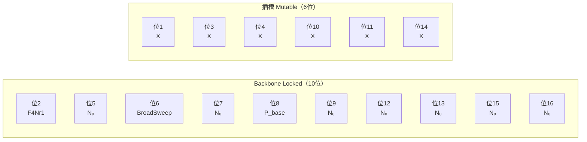
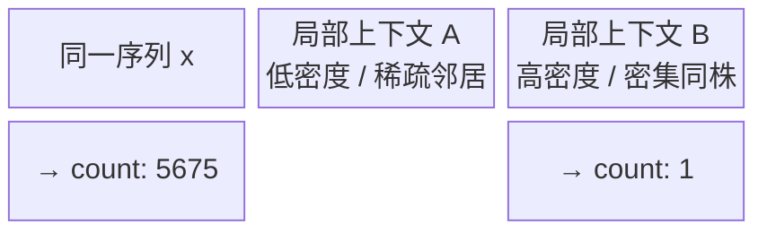

# 核心机制：地基、基元、模板、schema

## 三条 meta 地基

DES 的全部设计决策都从三条 meta 地基出发。任何看起来像「游戏设计」的选项，如果和这三条矛盾，就无条件排除。

1. **进化无目标。** 没有外部规定的适应度地标，没有终点，没有「更好」的绝对方向。演化只是频率在选择压力下的漂移，而选择压力本身由群体组成决定，随时间共演。
2. **红皇后频率依赖混战。** P2 已介绍红皇后混战的含义：频率升高的克隆株变成靶，优势随群体组成漂移。DES 将这一原则落地为四阵营对称对抗——同阵营不互斗，跨阵营相互中和，没有哪个阵营在设计层面占优。
3. **表型 = 序列的固定函数。严禁手写「谁强」。** 所有个体的行为（繁殖率、对抗力、突变倾向）完全由序列通过确定性计算派生，不存在任何外加的、依赖「我认为这个克隆株应该赢」判断的权重或系数。这条地基是数据纯净性的命根子：一旦手写「谁强」，产出的数据就不再是涌现的演化轨迹，而是设计者意图的反射。

三条地基不是风格偏好，是可证伪的设计约束。任何违反它们的修改都会让数据失去作为外部靶场的资格。

## 统一基元

DES 的全部演化行为由**统一基元**这一单一抽象构建。基元的形式是：

$$
\text{formula}(x,\, i) \;\longrightarrow\; \text{输出束}
$$

其中 $x$ 是个体的完整序列，$i$ 是当前计算所在的序列位置。输出束是三类通道的任意非空子集：

- **F（繁衍）**：派生该位的繁殖贡献
- **P（突变）**：派生该位的突变概率或突变谱
- **Z（对抗）**：派生该位的对抗强度

这是一阶函数的设计——基元只读序列和位置，不读全局状态，不依赖历史，不感知其他个体的标识。所有复杂的群体层面涌现，都来自大量基元在格子世界里的局部叠加，而不来自任何全局协调器。

**backbone 位与插槽位的唯一区别**在于该位是否参与突变。backbone 位（locked）在每次突变事件中被跳过，序列内容保持不变；插槽位（mutable）可被突变采样覆写。两者在表型计算时完全平等——locked 位照样参与 `formula(x, i)` 计算，只是不会在遗传上改变。这个设计让骨架基元（如 `F4Nr1` 的方向锁定）可以稳定遗传，同时保留进化的自由度集中在插槽上。

## 上位规则：κ 同通道族自协同

基元默认是位置独立的——每一位的输出只依赖 $x$ 和 $i$，不感知邻居。但 DES 提供了一个**上位效应**机制，允许同通道族的基元之间产生协同放大：

$$
\text{量}_{adj}(i) = \text{clamp}\!\left(\text{量}_{base}(i) \cdot (1+\kappa)^{n_{same}(i)}\right)
$$

$n_{same}(i)$ 是同通道族邻居的计数——序列中与位置 $i$ 属于同一通道家族的基元个数。$\kappa$ 是全局上位系数。当 $\kappa = 0$ 时，$(1+\kappa)^{n_{same}} = 1$，上位效应完全退化，每一位的输出量与邻居无关，等同于无上位效应的独立基元模型。当前默认参数将 $\kappa$ 锁死为 0，意味着首批数据完全没有上位协同，选择信号来自基元本身的表型差异，而非族群效应的放大。

`clamp` 保证输出量不超过物理上界，防止连锁放大产生数值爆炸。

## 结局常数：锁死 registry，永不进 CLI/config

以下七个参数在整个引擎中被称为**结局常数**，它们只存在于 registry 的静态定义里，不暴露给命令行参数，不出现在任何配置文件中：

| 常数 | 含义 |
|------|------|
| $\mu$ | 基础突变率 |
| $z_{max}$ | 对抗强度上界 |
| $\delta$ | 繁衍衰减系数 |
| $p_{max}$ | 突变概率上界 |
| $\alpha$ | 对抗非线性指数 |
| $\kappa$ | 上位协同系数 |
| $\beta$ | K 墙仲裁温度参数 |

为什么要把它们锁死？原因是**防止手调污染数据的涌现性**。如果研究者可以在跑一局之前调整 $\mu$ 或 $\delta$，就可以通过参数选择偏向某种结局——让某阵营更容易固定，或者让突变率高到掩盖选择信号。这与地基③「严禁手写谁强」在原理上同源：手调结局常数是一种更隐蔽的手写强弱，产出的数据记录的是参数选择的结果，而非自由演化的涌现。锁死到 registry 之后，任何使用 DES 产出数据的研究者都可以确信：数据里看到的一切都是给定固定物理规则下的纯涌现。

## BB0 模板：16位骨架

BB0 是 DES 目前的标准基因组模板。它规定了一个 **16 位**序列，其中 **6 个插槽**（mutable）和 **10 个 locked backbone 位**。

backbone 中的关键位包括：`F4Nr1`（位2，锁定方向基元，决定繁衍向量）、`BroadSweep`（位6，宽谱对抗基元）、`P_base`（位8，基础突变率基元）；其余 locked 位均为 `N₀`（空基元，输出零贡献）。六个插槽分布在位 1、3、4、10、11、14，是演化压力实际作用的自由度。

**默认局**中四阵营全同条——所有阵营使用字节级完全相同的初始序列，唯一区别是 `faction` 标识。这保证了首批数据里对称性是真实的，不存在任何初始基因型上的不对称。

## 为什么放开起始基因型 ≠ 破无私货

viz 验收之眼在启动时可以放开为「同模板结构」模式，允许四阵营的六个插槽取不同的初始值。这个放开**不违反无私货原则**，理由如下：

放开的范围受 `validate_bb0_layout` 守门，它只允许插槽位的初始值不同，不允许改变 locked 位的内容、骨架结构、插槽位置，也不允许改变调色板映射。四阵营仍然使用同一个模板——相同的 G→P（基因型到表型）映射函数、相同的固定物理规则、相同的结局常数。没有任何系数是手写的「谁强」。初始基因型的差异会影响演化起点，但表型如何从序列中派生的规则完全对称，后续演化仍然是纯涌现的。默认路径（四阵营全同条）的字节级不变性有回退保证——如果不显式切换到「同模板结构」模式，行为与以前完全一致。

## Reframe（已锁结论）：f 不是标量

首批数据确认了一个无法回避的结论，它已被锁定为设计事实：

> **$f$ 不是标量 $f(\text{序列}) \to \text{适应度}$，而是上下文函数 $f(\text{株},\, \text{局部上下文}) \to \text{该株此 tick 增减}$。**

证据直接来自 parquet 数据：同一序列字符串在不同格子、不同 tick 的 `count` 可以从 5675 跌到 1，这两种极端值在数据里都实际出现。如果 $f$ 是序列的纯函数，同一序列在任何时刻、任何位置都应该表现出相同的适应度倾向；但数据里看到的是，相同的序列因所处的局部克隆组成不同（邻居是什么、密度如何、频率如何），会有截然不同的增减轨迹。

这个 reframe 在当前 DES 的实现层面是一个**观察结论**，不是一个新机制。DES 引擎本来就是上下文函数——K 墙 Gumbel-max 仲裁天然是频率依赖的，对抗中和天然依赖局部组成。标量适应度假设是外部分析者（和早期版本的选择算子假设）带进来的，DES 的数据只是把这个假设清晰地证伪了。

这个结论为 Ch.3 里对 $\varphi$ 可辨识性的讨论奠定基础：如果 $f$ 本质上是上下文函数，任何试图从 repertoire 截面数据中恢复一个纯序列标量 $\varphi$ 的方法，都必须先面对这个不可忽视的上下文依赖——它会直接体现为观测映射零空间的结构。
