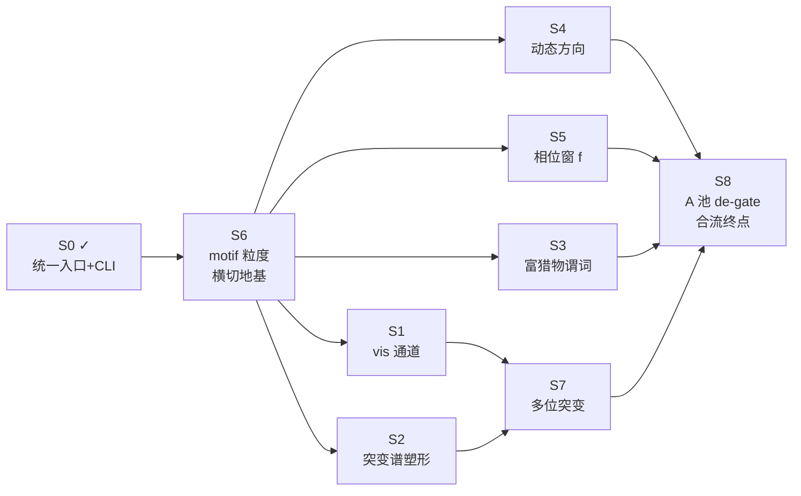
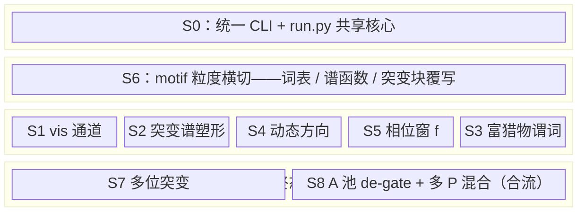

# 全 68 基元 9-spec 路线图

## 目标

registry 中目前落地的基元只有 6 个——BB0 模板的 10 个 locked 位里只有 `F4Nr1`、`BroadSweep`、`P_base` 是真正有行为的基元，其余均为 `N₀` 占位。9-spec 路线图的目标是将 registry 从 6 扩充至 **68 个全基元**，同时将 `src/`（PyTorch 后端引擎）与 `webapp/`（Astro 前端）统一为一个系统，保留两种运行模式：① 全 bash CLI，供 AI 代理批量产数据；② web 界面，供人工手动观察演化过程。

## 纪律

**游戏设计已终。** 凡是实现过程中出现「需要新增概念」的情况，必定是实现者对既有机制理解有误——解法是只补 registry 数据行、复用既有机制，而不是发明新玩法。这条纪律不是风格要求，是防止数据被私货污染的制度性约束。

## 9-spec 实现序

9 个 spec 全部写完并推上 `origin/main`（`f6d772f`），按以下固定顺序逐个落代码：

1. **S0 — 统一入口 + CLI match-runner（两种运行地基）：** 建立共享核心 `src/des/run.py` 与 CLI 前门 `scripts/run_match.py`；key allow-list 只放 `{players, grid, K, fill, T, seed}`，在入口处挡住结局常数进入任何 config 或命令行参数。
2. **S6 — motif 粒度（横切地基）：** 引入 `GRAN/MOTIF_LEN` 表，将 `_spectrum_for` 改为同粒度 + 等长预过滤，`_mutation_outcomes` 改为整块覆写；用 predicate-bit 方案建立全词表，`n_locked` 按需计算不再预存。
3. **S1 — vis 通道：** 为每个基元添加 per-primitive vis 字段，填入 S6 预留的 `FEAT_N_LOWVIS` 位，支持逆 vis 命中查询。
4. **S2 — 塑形突变谱：** `_spectrum_for` 读取 `SPECTRUM_SHAPE`（`power` / `family_mask` / `flatten_mix` 三旋钮）；新增 10 行 P 类基元覆盖不同谱形状。
5. **S4 — 动态方向：** F 池基元携带方向集；用 `crc32` 序列哈希锁定方向（`F4Nr1` 锁 1/4 方向），让方向成为序列的确定性函数而非随机抽取。
6. **S5 — 相位窗 f：** 引入 `FBURST` / `F_NOVA` 基元；激活条件 `on = ((T - birth) % burst_w) < burst_k`；繁衍率 `f = where(on, f_hi, f_lo)`；静态默认路径字节级不变，`f` 保留为 `f_hi` 的别名。
7. **S3 — 富猎物谓词：** 填入 S6 预留的 4 个阈值位（Crest / Hotspot Snipe / Mirror Fang / Void Bite），不改动 kernel 逻辑，只扩充谓词词表。
8. **S7 — 多位突变：** 引入 `slots_per_event`；`N == 1` 时行为字节级不变；`N ≥ 2` 时联合枚举多个插槽（`P_cascade` 覆盖 2 位联合枚举的典型情形）。
9. **S8 — A 池 24 极端 de-gate + 多 P 谱混合（合流终点）：** A 池 24 个极端基元解除 `n_locked` 门（纯 affinity 谱可达即可激活）；多 P 谱混合改为加权平均 `Σpᵢqᵢ / Σpᵢ` 取代原先的 dominant_p 规则。

S0 是整个路线图的入口层；S6 是横切地基，S1–S5 全部依赖它，必须优先完成；S1 和 S2 共同前置于 S7；S4、S5、S3、S7 四路在 S8 合流。

## 9-spec 在系统中的位置

## 评审两裁定

两条裁定已 bake 进所有 spec，并写入 memory。

**裁定①：谱重录基线。** 全 68 个 affinity 谱才是完整的设计意图。当前 registry 仅有 6 字母的残缺截断版本——这意味着现有 fixture 是对不完整 registry 的快照，不能作为 68 基元落地后的参考基线。正确做法是：待 S8 完成、全 68 affinity 谱进入 registry 之后，**RE-RECORD** 所有 byte-equal fixtures；此后字节锁只护卫非 registry 代码路径，registry 数据行本身的变化不触发回归失败。

**裁定②：多 P 谱混合归 S8。** 多个 P 类基元同时激活时，混合规则由原先的「dominant_p 单谱主导」改为加权平均 `Σpᵢqᵢ / Σpᵢ`（`pᵢ` 为各 P 基元的谱权重，`qᵢ` 为对应的突变分布）。该改动依赖 S7 多位枚举的基础设施，因此归入 S8 而非独立前置。

## 实现进度

**S0 ✓（2026-06-25，commits a631656..7704b5b，push origin/main，165 passed）**：完成 `src/des/run.py` 共享核心提取、`scripts/run_match.py` CLI 前门（key allow-list 守门只放 6 字段）、tests 从 146 增至 165；6 个 sub-plan task 全部通过 Spec ✅ Quality Approved 评审。

**下一闸：S6**（motif 粒度横切地基，sub-plan 1537 行）。S6 / S1 / S2 / S4 / S5 / S3 / S7 / S8 均待实现。

## 未碰的独立闸

**非对称角色系统**（per-faction 差异化 K 上限 / 差异化突变率 / 差异化机制）是一个与 68 基元落地完全正交的独立 HARD-GATE，目前未碰。它需要用户拍板后才能进入 brainstorming，与当前路线图的推进无关。
