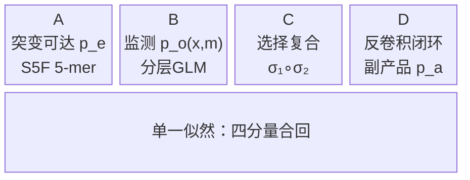

# σ 解析反演：数学骨架与可辨识地图

## 1. 定位与纪律

σ 解析反演这条线的任务是**正面反演观测算子 σ**——把抗体 repertoire 的采样/存活投影四分量合回单一似然，诚实标记零空间的维度和结构。它不是造一个更好的功能预测器，也不是重新推断 φ（亲和→适应度 link，那是 φ 模拟推断兄弟线的工作）。

外部铁证是 Evo-PU（arXiv:2605.06879），它提供了类先验的数学骨架；σ 解析反演站在它肩上，专门补它对抗体 repertoire 观测算子的空白。核心纪律只有两条：反演**整个**观测算子，诚实标零空间——缺一不可。

$p_a$（功能成分）是副产品，来自四分量中的 D 分量（反卷积闭环），不是另起的目标。把副产品当目标会滑回「功能预测器」陷阱，破坏 A/B 责任隔离。

## 2. 数学骨架

Evo-PU 给出的类先验形式：

$$P(O=1\mid x) = p_a \cdot \left[1 - \prod_{y \in Y(x)} (1 - p_o \cdot p_e)\right]$$

$O=1$ 表示序列 $x$ 在 repertoire 中被观测到；$Y(x)$ 是 $x$ 的突变邻域；$p_e$ 是突变可达概率；$p_o$ 是监测/采样概率。整个括号项是「经由任意一条突变路径可达且被监测到」的复合概率，$p_a$ 是功能选择权重。

四分量必须**同时**出现在同一个似然里，分开建模再拼接不叫「彻底」：

C 分量展开为 $\sigma_1 \circ \sigma_2$：$\sigma_1$ 执行 out-of-frame 筛查（移码直接淘汰），$\sigma_2$ 是 T-help 瓶颈竞争（Victora-Nussenzweig）的非线性存活率。

## 3. 可辨识地图

Stage 2 的核心工作是给每个分量画出可辨识度上界，而非盲目假设「足够多的数据就能辨识」。

| 分量 | 可辨识度 | 备注 |
|------|---------|------|
| $p_a$ | 可辨到单调变换 | 相对大小可知，绝对尺度不可知 |
| $\sigma_2$ | 仅 contrast 可辨 | 拐点处辨斜率耦合 |
| $\sigma_1$ | 可辨到尺度 | out-of-frame 率提供锚点 |
| $p_o$ | 跨 study contrast 可辨* | single-study 内 irreducible |

**中心结果：** $(p_e,\, \text{选择},\, p_o)$ 三者**不联合可辨**——Bakis-Minin 证明存在参数变换 $(\lambda, \mu, \rho)$ 使观测分布不变。这不是数据不够多的问题，而是模型结构的内禀限制。Stage 2 还对 6 条承重假设逐一做 negate，没有一条能绕开这一结论。

## 4. ★ CR9114 硬实例

可辨识性不只是理论陈述——真实数据给出了一个没有退路的硬实例。

对 CR9114 完备 DMS 数据（65094 行）计算突变可达矩阵 $S_{\text{mut}}$ 与选择矩阵 $S_{\text{sel}}$ 的主夹角：

$$\theta(S_{\text{mut}},\, S_{\text{sel}}) = 0.0°$$

夹角为零意味着裸突变计数与选择信号在线性空间中**完全混淆**——用扁平 Hamming 距离计算的 $p_e$ 根本无法从选择压力中分离出来。

这一结果把「使用 5-mer 上下文非线性 kernel」从工程便利**升级为辨识性必需**。没有非线性 kernel，$p_e$ 与选择的纠缠在代数层面就无法解开，后续所有推断都建立在混淆变量上。

零空间的两个独立来源由此明确：

1. **single-study 格子**：同一研究内，$p_o$ 的绝对值与选择效应混淆，格子内部不可辨。
2. **fitness-scale（1维）**：$p_a$ 的绝对尺度构成一维零空间，只有相对排序可知。

## 5. ★ 新认知：ascertainment 桥

Stage 1 发现了一个把数学骨架与统计采样理论打通的等价关系，Stage 4 把它从类比升格为代数等价：

$$\left[1 - \prod_{y \in Y(x)}(1 - p_o \cdot p_e)\right] \;\equiv\; \text{birth-death 非灭绝 ascertainment 因子}$$

Evo-PU 的类先验在形式上与 birth-death 过程的「非灭绝条件概率」完全同构——「至少被观测一次」正是「谱系未在观测窗口内灭绝」的离散化表达。

这一等价的实用价值在于：可辨识性分析可以借用 ascertainment 同余类的整套工具，而不必从头推导 repertoire 专属的辨识条件。共线性、零空间的维度计算、部分可辨识参数的置信区间——这些在 ascertainment 文献里都有成熟结论，直接接上即可。
