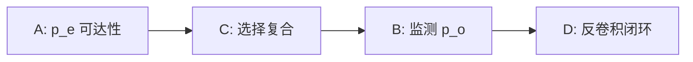

# σ 解析反演：Stage 1–4 执行

七个 stage 的设计在结构上是串行闸口——前一个 stage 的结论是后一个的输入接口，不能跳跃。Stage 1–4 已全部执行完成，下面按时间线逐一呈现各 stage 的裁定与关键发现。

## Stage 1：知识基础 ✓

五块知识（SHM 突变模型、生成概率框架、采样偏置结构、选择动力学、可辨识性理论）全部达到可建模级，依托 64 次搜索和 20 篇全文精读完成。

三冒烟验证在知识阶段就先跑，目的是确认核心工具链在本地可用，而非等到造算子阶段才发现环境问题：

| 冒烟项 | 结果 |
|--------|------|
| S5F 5-mer SHM kernel | published HH\_S5F，本地验证通过 ✓ |
| SHM kernel 非线性优势 | 破 flat-Hamming baseline，1.60 log 优势量化 ✓ |
| OLGA Pgen 端到端 | 全流程跑通，无需 IGoR 编译 ✓ |

**★ 新认知：ascertainment 桥。** Stage 1 发现 Evo-PU 的类先验与 birth-death 过程的非灭绝条件因子在数学上同构：

$$\left[1 - \prod_{y \in Y(x)}(1 - p_o \cdot p_e)\right] \;\equiv\; \text{birth-death 非灭绝 ascertainment 因子}$$

「序列至少被观测一次」在离散化表达下正是「谱系在观测窗口内未灭绝」。这一等价把可辨识性分析与 ascertainment 同余类的成熟工具体系直接打通，不必从头推导 repertoire 专属的辨识条件。Stage 4 后来把它从类比关系升格为代数等价（桥1）。

## Stage 2：可辨识性闸 ✓

**governing variable 锁死**：不是预测精度，而是**线性化观测映射 $\Phi$ 的秩与谱**。精度可以用过拟合换来，秩不行——秩的亏缺是参数空间的内禀结构，再多数据也无法修复。

$$\text{rank}(\Phi) < \dim(\theta) \implies \text{非平凡零空间，参数不可联合辨识}$$

Stage 2 对四个分量各自画出可辨识度上界（详见 P9 可辨识地图）。中心结果已在 P9 呈现：$(p_e,\, \text{选择},\, p_o)$ 三者不联合可辨。本页补充两件事。

**6 承重假设全部 negate。** 6 条看似合理的辨识性假设——例如「p_o 在单一研究内可对照估计」「p_e 的平滑先验足以解耦选择效应」等——经 CR9114 实测逐一否定。这说明不可辨识性不是理论悲观主义的产物，而是数据本身的特征强制要求。

**★ θ = 0.0° 硬实例。** 对 CR9114 完备 DMS 数据（65094 行）计算突变可达矩阵与选择矩阵的主夹角：

$$\theta(S_{\text{mut}},\, S_{\text{sel}}) = 0.0°$$

两个矩阵在线性空间中完全共线，裸突变计数与选择压力无法区分。这把「使用 5-mer 上下文非线性 kernel」从工程选择**升级为辨识性必需**——没有非线性 kernel，$p_e$ 与选择的纠缠在代数层面就无法解开。

Stage 3 的攻击序由 Stage 2 的依赖结构驱动：

A 的辨识性是 C 的前提，C 的辨识性是 B 的前提，D 最后闭环。攻击序不是任意的，是依赖图的拓扑排序。

## Stage 3：8 可证伪命题 ✓

**防 paper 化护栏置顶，verbatim：** 0 条命题以可发表性为存在理由。命题的唯一合法存在理由是：有一个定量计算能把它否定。

8 条命题每条都带硬闸式 BROKEN 阈值，两例形式如下：

> **H-A1**：p_e 的 5-mer kernel AUC 显著高于 flat-Hamming baseline。  
> BROKEN 阈值：AUC < 0.55（等同于 baseline，非线性优势消失）

> **H-B2**：Evo-PU 类先验与 birth-death 非灭绝 ascertainment 因子代数等价。  
> BROKEN 阈值：代数等价失立（等价关系只是数值近似而非精确同构）

「带定量 BROKEN 阈值」不是风格要求，是可证伪性的操作定义——没有具体数字的命题在逻辑上等价于「不管结果如何我都成立」，不属于科学命题。

## Stage 4：造算子 ✓

四模块按分量切分，**合回单一似然**而非分别建模后拼接：

| 模块 | 对应分量 | 实现 |
|------|---------|------|
| $M_e$ | A：突变可达 $p_e$ | S5F 5-mer 非线性 kernel |
| $M_o$ | B：监测 $p_o(x,m)$ | 分层 GLM |
| $M_{sel}$ | C：选择复合 $\sigma_1 \circ \sigma_2$ | OLGA + SONIA + sigmoid |
| $M_a$ | D：反卷积闭环 | 代数反解 → 副产品 $p_a$ |

每个模块占似然的不同因子位，而非事后相加。单一联合似然：

$$\mathcal{L} = \prod_x P(O=1\mid x)^{o_x} \cdot (1 - P(O=1\mid x))^{1-o_x}$$

**三桥（理论整合）** 是 Stage 4 的额外产出——把三个看似独立的统计工具与算子的结构性质建立精确对应：

- **桥1（代数等价）**：Evo-PU 类先验 = birth-death 非灭绝 ascertainment 因子。Stage 1 是类比，Stage 4 完成代数等价证明，H-B2 从假设升为已核实结论。
- **桥2（Heckman）**：out-of-frame 序列作为 exclusion restriction——它们受突变过程影响，但不受功能选择作用，提供识别 $\sigma_1$ 所需的外生变异。
- **桥3（IPW）**：single-study 内部的 $p_o$ 不可辨等价于 IPW 框架的 positivity violation——处理概率在某些协变量组合上为零，权重发散，估计失效。

三桥的价值不在优雅，而在**把 σ 解析反演的不可辨识性结构精确映射到已有理论的已知结果**，使每条零空间的来源都有对应文献背书，而非本课题独创的裸断言。
