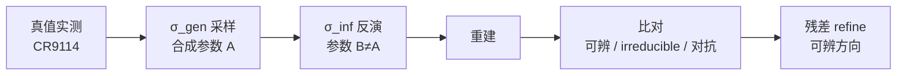

# σ 解析反演：Stage 5–7 执行

Stage 5–7 是整个 σ 解析反演设计的后半段——从收敛审查到自建证伪套，再到闭环验证设计。三个 stage 全部执行完成（Stage 7 只设计不实跑），最终产出 FalsificationLedger 三桶裁定，把 11 条主张的诚实状态公开摆出来。

## Stage 5：收敛审查 ✓

**verdict = ACCEPT WITH REVISE**。多准则评分 21/25，评分轴明确禁止「可发表性」——不以「结果能发出去吗」为准则，只以「设计是否自洽、可证伪、结构正确」为准则。

feasibility 真测结果：OLGA / CR9114 / 核心栈三项在本地可即跑；SONIA 和 netam-Thrifty 尚未安装，但两者的硬性依赖出现在 Stage 7，现阶段不构成阻塞。

收敛给出 4 条 REVISE，逐一落实：

| 修订 | 内容 |
|------|------|
| R1 | 破循环主力 = $\sigma_{\text{gen}}$/$\sigma_{\text{inf}}$ 分量层独立（非双 kernel） |
| R2 | 加性假设 = toy 简化，不作为正式主张 |
| R3 | $p_o$ 估计带星号，反映 single-study 内部不可辨的残余 |
| R4 | $\sigma_1$/$\sigma_2$ 改为 model-based，而非启发式分割 |

R1 是最关键的一条：原设计用「双 kernel 同 SHM family」尝试破循环，但 Stage 6 确认这只是 PARTIAL 去循环——真正破循环靠的是 $\sigma_{\text{gen}}$（生成侧）与 $\sigma_{\text{inf}}$（反演侧）在分量层上的独立参数化，两侧共享 SHM family 的结构性约束，但参数路径完全分离。

## Stage 6：自建证伪套 ✓

Stage 6 把「赢的条件」整体翻转为**主动证伪**——不是「能拟合数据」就算成功，而是「主动尝试攻击自己、攻击失败才算成立」。产出 FalsificationLedger 三桶，刻意不设 resilience 分数和 hardening 标记，防止把「抗住了攻击」包装成勋章。

**circular-validation-audit 先跑，gate Stage 7。** 结果：CONDITIONAL GREEN-LIGHT。条件是 4 条对抗真值必须硬性进入最终设计，不允许绕开：

1. non-sigmoid 选择函数（检验 $\sigma_2$ 的函数形式假设）
2. 真实 OAS 监测数据 + 未知 single-study 格子（检验 $p_o$ 的跨研究结构）
3. 非 SHM 可达的序列路径（检验 $p_e$ 解耦是否依赖 SHM 特殊性）
4. $\sigma$ 部分可吸收场景（检验反演是否能诚实报告零空间边界）

四条对抗真值不是可选项，是设计的承重构件——少一条，Stage 7 的硬闸就不成立。

## Stage 7：闭环验证设计（只设计）✓

Stage 7 的核心是**六环闭环**：从真值出发，经合成、反演、重建、比对，最终把残差归还到可辨识方向，而不是用残差来修改理论。

参数 A 由 $\sigma_{\text{gen}}$ 唯一确定，参数 B 由 $\sigma_{\text{inf}}$ 独立反演得出。**B ≠ A 是设计意图，不是误差**——零空间的不可恢复部分应当体现为 B 与 A 在 irreducible 方向上的系统偏差，可恢复部分则应收敛。

**2 真实交叉验证轴**（不含纯合成沙盒）：

- **DeWitt GC-replay**（Zenodo 15022130）：生发中心重放数据，提供 $\sigma_2$ 的真值锚。$\sigma_2$ 的拐点结构在这条轴上直接可测。
- **OAS**（oas-unpaired）：提供 $p_o$ 的协变量，同时是 ★C5 的判决场——控 study 后 cell 偏 $R^2 < 0.05$ 即宣告 C5 BROKEN。

**判别第四路**：引入纯统计视角，对 $\pi \cdot S$ 形式盲（不知道算子分解结构），只看统计信号，判有效样本量 $N_{\text{eff}} \approx 1.3$。这个结果说明三桥 framing 引入了相当程度的诱导约束，$\sigma = \pi \cdot S$ 作为全局假设仍需第四路独立验证。

**4 零空间实证指标**：

| 指标 | 含义 |
|------|------|
| 可恢复率 | 可辨方向上 B 与 A 的一致程度 |
| $\dim R_{\text{irr}}$ | irreducible 零空间的实测维数 |
| $\theta$ 敏感带 | 主夹角随样本量的收敛曲线 |
| 对抗诚实失败率 | 4 条对抗真值下算子诚实报告零空间的比例 |

五项硬闸全部 PASS。

## FalsificationLedger 三桶摘要

11 条主张全部分桶裁定，无一悬空：

| 桶 | 数量 | 代表主张 |
|----|------|---------|
| CORROBORATED | 6 | C8（$\theta = 0.0°$ 硬证）/ C7（联合似然合一）/ C6（rung2 桥1）|
| BROKEN（条件性） | 1 | C3（out-of-frame 弱选择，已降级不致命）|
| TESTABLE-NOT-YET | 3 | ★C5（最危险）/ C1（$p_e$ 解耦）/ C4（$p_o$ 跨 study）|
| PROMISING-UNEARNED | 1 | C11（四分量 elegance，待 P1 兑现）|

**C3 降级细节**：out-of-frame 序列并非 selection-free——mRNA 稳定性和表达水平对它们施加弱选择压力。结果是 $\sigma_1$ 锚从「精确排除限制」降级为「弱选择 baseline + 偏差项」。辨识增益①减弱但不消失，设计不需回退。

**同构修正**：C6 原声称「本课题 σ = Evo-PU σ」，现降为 rung2——类先验等于非灭绝因子为真（代数等价成立），但 $p_o(x,m)$ 的监测结构和 germline lineage 的拓扑约束严格超出 Evo-PU 的覆盖范围。这个降级反而部分反驳了「σ 解析反演只是 Evo-PU 换数据集」的嫌疑：本课题的算子分解在结构上更复杂，不能简单归约。

$$N_{\text{eff}} \approx 1.3 \quad \Leftarrow \quad \text{三桥 framing 诱导，} \sigma = \pi \cdot S \text{ 降为强假设待第四路}$$

**★ 最大未决风险敞口：C5**。C5（H-A3 元数据非混杂）是 $p_o$ 可辨性的命门——完全押在 Stage 7 的 OAS 实测上。若控 study 后 cell 偏 $R^2 \geq 0.05$，C5 宣告 BROKEN，$\varepsilon$ 越界，需回 Stage 2 重审可辨性边界（需用户确认才进行）。

## 下一步

本 spec 到设计为止（Stage 7 只设计不实跑）。最小可行核——$M_a$ + S5F + OLGA + 分层 GLM + CR9114——现在即可启动代码实现，但需另起 `executing-specs` 流程，并经用户明确确认后才进入。未经确认，不动一行实现代码。
